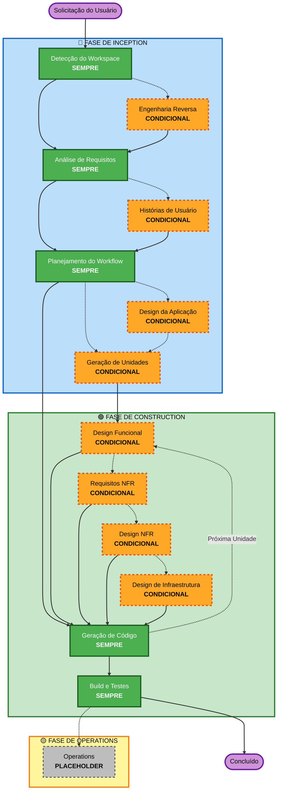

# Visão Geral do Workflow Adaptativo AI-DLC

**Propósito**: Referência técnica para o modelo de IA e desenvolvedores entenderem a estrutura completa do workflow.

**Nota**: Conteúdo semelhante existe em welcome-message.md (mensagem de boas-vindas ao usuário) e README.md (documentação). Esta duplicação é INTENCIONAL - cada arquivo serve a um propósito diferente:
- **Este arquivo**: Referência técnica detalhada com diagrama Mermaid para carregamento de contexto do modelo de IA
- **welcome-message.md**: Mensagem de boas-vindas voltada ao usuário com diagrama ASCII
- **README.md**: Documentação legível por humanos para o repositório

## O Ciclo de Vida em Três Fases:
• **FASE DE INCEPTION**: Planejamento e arquitetura (Detecção do Workspace + fases condicionais + Planejamento do Workflow)
• **FASE DE CONSTRUCTION**: Design, implementação, build e testes (design por unidade + Geração de Código + Build e Testes)
• **FASE DE OPERATIONS**: Placeholder para futuros workflows de implantação e monitoramento

## O Workflow Adaptativo:
• **Detecção do Workspace** (sempre) → **Engenharia Reversa** (apenas brownfield) → **Análise de Requisitos** (sempre, profundidade adaptativa) → **Fases Condicionais** (conforme necessário) → **Planejamento do Workflow** (sempre) → **Geração de Código** (sempre, por unidade) → **Build e Testes** (sempre)

## Como Funciona:
• **A IA analisa** sua solicitação, workspace e complexidade para determinar quais estágios são necessários
• **Estes estágios sempre executam**: Detecção do Workspace, Análise de Requisitos (profundidade adaptativa), Planejamento do Workflow, Geração de Código (por unidade), Build e Testes
• **Todos os outros estágios são condicionais**: Engenharia Reversa, Histórias de Usuário, Design da Aplicação, Geração de Unidades, estágios de design por unidade (Design Funcional, Requisitos NFR, Design NFR, Design de Infraestrutura)
• **Sem sequências fixas**: Os estágios executam na ordem que faz sentido para sua tarefa específica

## Papel da Sua Equipe:
• **Responder perguntas** em arquivos de perguntas dedicados usando tags [Answer]: com escolhas de letra (A, B, C, D, E)
• **Opção E disponível**: Escolha "Outro" e descreva sua resposta personalizada se as opções fornecidas não corresponderem
• **Trabalhar em equipe** para revisar e aprovar cada fase antes de prosseguir
• **Decidir coletivamente** a abordagem arquitetural quando necessário
• **Importante**: Este é um esforço de equipe - envolva stakeholders relevantes para cada fase

## Workflow AI-DLC em Três Fases:

**Descrições dos Estágios:**

**🔵 FASE DE INCEPTION** - Planejamento e Arquitetura
- Detecção do Workspace: Analisar estado do workspace e tipo de projeto (SEMPRE)
- Engenharia Reversa: Analisar base de código existente (CONDICIONAL - apenas Brownfield)
- Análise de Requisitos: Reunir e validar requisitos (SEMPRE - profundidade adaptativa)
- Histórias de Usuário: Criar histórias de usuário e personas (CONDICIONAL)
- Planejamento do Workflow: Criar plano de execução (SEMPRE)
- Design da Aplicação: Identificação de componentes de alto nível e design da camada de serviço (CONDICIONAL)
- Geração de Unidades: Decompor em unidades de trabalho (CONDICIONAL)

**🟢 FASE DE CONSTRUCTION** - Design, Implementação, Build e Testes
- Design Funcional: Design detalhado da lógica de negócio por unidade (CONDICIONAL, por unidade)
- Requisitos NFR: Determinar NFRs e selecionar stack tecnológica (CONDICIONAL, por unidade)
- Design NFR: Incorporar padrões NFR e componentes lógicos (CONDICIONAL, por unidade)
- Design de Infraestrutura: Mapear para serviços reais de infraestrutura (CONDICIONAL, por unidade)
- Geração de Código: Gerar código com Parte 1 - Planejamento, Parte 2 - Geração (SEMPRE, por unidade)
- Build e Testes: Compilar todas as unidades e executar testes abrangentes (SEMPRE)

**🟡 FASE DE OPERATIONS** - Placeholder
- Operations: Placeholder para futuros workflows de implantação e monitoramento (PLACEHOLDER)

**Princípios-Chave:**
- As fases executam apenas quando agregam valor
- Cada fase é avaliada independentemente
- INCEPTION foca em "o quê" e "por quê"
- CONSTRUCTION foca em "como" mais "build e testes"
- OPERATIONS é placeholder para expansão futura
- Mudanças simples podem pular estágios condicionais de INCEPTION
- Mudanças complexas recebem tratamento completo de INCEPTION e CONSTRUCTION
