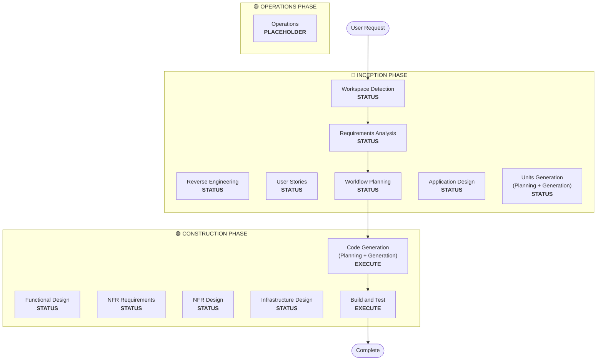

# Planejamento do Workflow

**Propósito**: Determinar quais fases executar e criar um plano de execução abrangente

**Sempre Executar**: Esta fase sempre roda após entender os requisitos e o escopo

## Etapa 1: Carregar Todo o Contexto Prévio

### 1.1 Carregar Artefatos de Engenharia Reversa (se brownfield)
- architecture.md
- component-inventory.md
- technology-stack.md
- dependencies.md

### 1.2 Carregar Análise de Requisitos
- requirements.md (inclui análise de intenção)
- requirement-verification-questions.md (com respostas)

### 1.3 Carregar Histórias de Usuário (se executado)
- stories.md
- personas.md

## Etapa 2: Análise Detalhada de Escopo e Impacto

**Agora que temos contexto completo (requisitos + histórias), realize análise detalhada:**

### 2.1 Detecção de Escopo de Transformação (Apenas Brownfield)

**SE projeto brownfield**, analise o escopo de transformação:

#### Transformação Arquitetural
- **Mudança de componente único** vs **transformação arquitetural**
- **Mudanças de infraestrutura** vs **mudanças de aplicação**
- **Mudanças no modelo de implantação** (Lambda→Container, EC2→Serverless, etc.)

#### Identificação de Componentes Relacionados
Para transformações, identifique:
- **Código de infraestrutura** que precisa de atualizações
- **Stacks CDK** que exigem mudanças
- Configurações de **API Gateway**
- Requisitos de **load balancer**
- Mudanças de **rede** necessárias
- Adaptações de **monitoramento/logging**

#### Impacto Entre Pacotes
- Pacotes de **infraestrutura CDK** que exigem atualizações
- **Modelos compartilhados** que precisam de atualizações de versão
- **Bibliotecas cliente** que exigem mudanças de endpoint
- **Pacotes de teste** que precisam de novos cenários de teste

### 2.2 Avaliação de Impacto da Mudança

#### Áreas de Impacto
1. **Mudanças voltadas ao usuário**: Isso afeta a experiência do usuário?
2. **Mudanças estruturais**: Isso muda a arquitetura do sistema?
3. **Mudanças no modelo de dados**: Isso afeta schemas de banco de dados ou estruturas de dados?
4. **Mudanças de API**: Isso afeta interfaces ou contratos?
5. **Impacto NFR**: Isso afeta desempenho, segurança ou escalabilidade?

#### Impacto na Camada de Aplicação (se aplicável)
- **Mudanças de código**: Novos pontos de entrada, adapters, configurações
- **Dependências**: Novas bibliotecas, mudanças de framework
- **Configuração**: Variáveis de ambiente, arquivos de config
- **Testes**: Testes unitários, testes de integração

#### Impacto na Camada de Infraestrutura (se aplicável)
- **Modelo de implantação**: Lambda→ECS, EC2→Fargate, etc.
- **Rede**: VPC, security groups, load balancers
- **Armazenamento**: Volumes persistentes, armazenamento compartilhado
- **Escalabilidade**: Políticas de auto-scaling, planejamento de capacidade

#### Impacto na Camada de Operations (se aplicável)
- **Monitoramento**: CloudWatch, métricas customizadas, dashboards
- **Logging**: Agregação de logs, logging estruturado
- **Alertas**: Configurações de alarmes, canais de notificação
- **Implantação**: Mudanças no pipeline de CI/CD, estratégias de rollback

### 2.3 Mapeamento de Relacionamentos de Componentes (Apenas Brownfield)

**SE projeto brownfield**, criar grafo de dependências de componentes:

```markdown
## Component Relationships
- **Primary Component**: [Package being changed]
- **Infrastructure Components**: [CDK/Terraform packages]
- **Shared Components**: [Models, utilities, clients]
- **Dependent Components**: [Services that call this component]
- **Supporting Components**: [Monitoring, logging, deployment]
```

Para cada componente relacionado:
- **Tipo de Mudança**: Major, Minor, Configuration-only
- **Motivo da Mudança**: Dependência direta, modelo de implantação, rede
- **Prioridade da Mudança**: Critical, Important, Optional

### 2.4 Avaliação de Risco

Avalie o nível de risco:
1. **Baixo**: Mudança isolada, rollback fácil, bem compreendida
2. **Médio**: Múltiplos componentes, rollback moderado, alguns desconhecidos
3. **Alto**: Impacto em todo o sistema, rollback complexo, desconhecidos significativos
4. **Crítico**: Crítico para produção, rollback difícil, alta incerteza

## Etapa 3: Determinação de Fases

### 3.1 Histórias de Usuário - Já Executado ou Pular?
**Já executado**: Ir para a próxima determinação
**Não executado - Executar SE**:
- Múltiplas personas de usuário
- Impacto na experiência do usuário
- Critérios de aceitação necessários
- Colaboração de equipe necessária

**Pular SE**:
- Refatoração interna
- Correção de bug com reprodução clara
- Redução de dívida técnica
- Mudanças de infraestrutura

### 3.2 Design da Aplicação - Executar SE:
- Novos componentes ou serviços necessários
- Métodos de componentes e regras de negócio precisam de definição
- Design da camada de serviço necessário
- Dependências de componentes precisam de esclarecimento

**Pular SE**:
- Mudanças dentro dos limites de componentes existentes
- Nenhum novo componente ou método
- Mudanças puramente de implementação

### 3.3 Geração de Unidades - Executar SE:
- Novos modelos de dados ou schemas
- Mudanças de API ou novos endpoints
- Algoritmos complexos ou lógica de negócio
- Mudanças de gerenciamento de estado
- Múltiplos pacotes exigem mudanças
- Atualizações de infrastructure-as-code necessárias

**Pular SE**:
- Mudanças de lógica simples
- Mudanças apenas de UI
- Atualizações de configuração
- Implementações diretas

### 3.4 Implementação NFR - Executar SE:
- Requisitos de desempenho
- Considerações de segurança
- Preocupações de escalabilidade
- Monitoramento/observabilidade necessário

**Pular SE**:
- Configuração NFR existente suficiente
- Nenhum novo requisito NFR
- Mudanças simples sem impacto NFR

## Etapa 4: Observar Detalhe Adaptativo

**Veja [depth-levels.md](../common/depth-levels.md) para explicação da profundidade adaptativa**

Para cada estágio que será executado:
- Todos os artefatos definidos serão criados
- O nível de detalhe dentro dos artefatos se adapta à complexidade do problema
- O modelo determina o detalhe apropriado com base nas características do problema

## Etapa 5: Análise de Coordenação Multi-Módulo (Apenas Brownfield)

**SE brownfield com múltiplos módulos/pacotes**, analise dependências e determine a estratégia ideal de atualização:

### 5.1 Analisar Dependências de Módulos
- Examinar dependências do sistema de build e manifests de dependências
- Identificar dependências de build-time vs runtime
- Mapear contratos de API e interfaces compartilhadas entre módulos

### 5.2 Determinar Estratégia de Atualização
Com base na análise de dependências, decida:
- **Sequência de atualização**: Quais módulos devem ser atualizados primeiro devido a dependências
- **Oportunidades de paralelização**: Quais módulos podem ser atualizados simultaneamente
- **Requisitos de coordenação**: Compatibilidade de versão, contratos de API, ordem de implantação
- **Estratégia de testes**: Abordagem de testes por módulo vs integrada
- **Estratégia de rollback**: Plano de recuperação se falhas ocorrerem no meio da sequência

### 5.3 Documentar Plano de Coordenação
```markdown
## Module Update Strategy
- **Update Approach**: [Sequential/Parallel/Hybrid]
- **Critical Path**: [Modules that block other updates]
- **Coordination Points**: [Shared APIs, infrastructure, data contracts]
- **Testing Checkpoints**: [When to validate integration]
```

Identifique para cada módulo afetado:
- **Prioridade de atualização**: Must-update-first vs can-update-later
- **Restrições de dependência**: Do que depende, o que depende dele
- **Escopo da mudança**: Major (breaking), Minor (compatible), Patch (fixes)

## Etapa 6: Gerar Visualização do Workflow

Criar flowchart Mermaid mostrando:
- Todas as fases em sequência
- Decisão EXECUTE ou SKIP para cada fase condicional
- Estilização apropriada para cada estado de fase

**Regras de estilização** (adicionar após o flowchart):
```
style WD fill:#4CAF50,stroke:#1B5E20,stroke-width:3px,color:#fff
style CG fill:#4CAF50,stroke:#1B5E20,stroke-width:3px,color:#fff
style BT fill:#4CAF50,stroke:#1B5E20,stroke-width:3px,color:#fff
style US fill:#BDBDBD,stroke:#424242,stroke-width:2px,stroke-dasharray: 5 5,color:#000
style Start fill:#CE93D8,stroke:#6A1B9A,stroke-width:3px,color:#000
style End fill:#CE93D8,stroke:#6A1B9A,stroke-width:3px,color:#000

linkStyle default stroke:#333,stroke-width:2px
```

**Diretrizes de Estilo**:
- Concluído/Sempre executar: `fill:#4CAF50,stroke:#1B5E20,stroke-width:3px,color:#fff` (Material Green com texto branco)
- Condicional EXECUTE: `fill:#FFA726,stroke:#E65100,stroke-width:3px,stroke-dasharray: 5 5,color:#000` (Material Orange com texto preto)
- Condicional SKIP: `fill:#BDBDBD,stroke:#424242,stroke-width:2px,stroke-dasharray: 5 5,color:#000` (Material Gray com texto preto)
- Start/End: `fill:#CE93D8,stroke:#6A1B9A,stroke-width:3px,color:#000` (Material Purple com texto preto)
- Containers de fase: Usar cores Material mais claras (INCEPTION: #BBDEFB, CONSTRUCTION: #C8E6C9, OPERATIONS: #FFF59D)

## Etapa 7: Criar Documento do Plano de Execução

Criar `aidlc-docs/inception/plans/execution-plan.md`:

```markdown
# Execution Plan

## Detailed Analysis Summary

### Transformation Scope (Brownfield Only)
- **Transformation Type**: [Single component/Architectural/Infrastructure]
- **Primary Changes**: [Description]
- **Related Components**: [List]

### Change Impact Assessment
- **User-facing changes**: [Yes/No - Description]
- **Structural changes**: [Yes/No - Description]
- **Data model changes**: [Yes/No - Description]
- **API changes**: [Yes/No - Description]
- **NFR impact**: [Yes/No - Description]

### Component Relationships (Brownfield Only)
[Component dependency graph]

### Risk Assessment
- **Risk Level**: [Low/Medium/High/Critical]
- **Rollback Complexity**: [Easy/Moderate/Difficult]
- **Testing Complexity**: [Simple/Moderate/Complex]

## Workflow Visualization



**Note**: Replace STATUS placeholders with actual phase status (COMPLETED/SKIP/EXECUTE) and apply appropriate styling

## Phases to Execute

### 🔵 INCEPTION PHASE
- [x] Workspace Detection (COMPLETED)
- [x] Reverse Engineering (COMPLETED/SKIPPED)
- [x] Requirements Analysis (COMPLETED)
- [x] User Stories (COMPLETED/SKIPPED)
- [x] Execution Plan (IN PROGRESS)
- [ ] Application Design - [EXECUTE/SKIP]
  - **Rationale**: [Why executing or skipping]
- [ ] Units Generation - [EXECUTE/SKIP]
  - **Rationale**: [Why executing or skipping]

### 🟢 CONSTRUCTION PHASE
- [ ] Functional Design - [EXECUTE/SKIP]
  - **Rationale**: [Why executing or skipping]
- [ ] NFR Requirements - [EXECUTE/SKIP]
  - **Rationale**: [Why executing or skipping]
- [ ] NFR Design - [EXECUTE/SKIP]
  - **Rationale**: [Why executing or skipping]
- [ ] Infrastructure Design - [EXECUTE/SKIP]
  - **Rationale**: [Why executing or skipping]
- [ ] Code Generation - EXECUTE (ALWAYS)
  - **Rationale**: Implementation planning and code generation needed
- [ ] Build and Test - EXECUTE (ALWAYS)
  - **Rationale**: Build, test, and verification needed

### 🟡 OPERATIONS PHASE
- [ ] Operations - PLACEHOLDER
  - **Rationale**: Future deployment and monitoring workflows

## Package Change Sequence (Brownfield Only)
[If applicable, list package update sequence with dependencies]

## Estimated Timeline
- **Total Phases**: [Number]
- **Estimated Duration**: [Time estimate]

## Success Criteria
- **Primary Goal**: [Main objective]
- **Key Deliverables**: [List]
- **Quality Gates**: [List]

[IF brownfield]
- **Integration Testing**: All components working together
- **Operational Readiness**: Monitoring, logging, alerting working
```

## Etapa 8: Inicializar Rastreamento de Estado

Atualizar `aidlc-docs/aidlc-state.md`:

```markdown
# AI-DLC State Tracking

## Project Information
- **Project Type**: [Greenfield/Brownfield]
- **Start Date**: [ISO timestamp]
- **Current Stage**: INCEPTION - Workflow Planning

## Execution Plan Summary
- **Total Stages**: [Number]
- **Stages to Execute**: [List]
- **Stages to Skip**: [List with reasons]

## Stage Progress

### 🔵 INCEPTION PHASE
- [x] Workspace Detection
- [x] Reverse Engineering (if applicable)
- [x] Requirements Analysis
- [x] User Stories (if applicable)
- [x] Workflow Planning
- [ ] Application Design - [EXECUTE/SKIP]
- [ ] Units Generation - [EXECUTE/SKIP]

### 🟢 CONSTRUCTION PHASE
- [ ] Functional Design - [EXECUTE/SKIP]
- [ ] NFR Requirements - [EXECUTE/SKIP]
- [ ] NFR Design - [EXECUTE/SKIP]
- [ ] Infrastructure Design - [EXECUTE/SKIP]
- [ ] Code Generation - EXECUTE
- [ ] Build and Test - EXECUTE

### 🟡 OPERATIONS PHASE
- [ ] Operations - PLACEHOLDER

## Current Status
- **Lifecycle Phase**: INCEPTION
- **Current Stage**: Workflow Planning Complete
- **Next Stage**: [Next stage to execute]
- **Status**: Ready to proceed
```

## Etapa 9: Apresentar Plano ao Usuário

```markdown
# 📋 Planejamento do Workflow Concluído

Criei um plano de execução abrangente com base em:
- Sua solicitação: [Resumo]
- Sistema existente: [Resumo se brownfield]
- Requisitos: [Resumo se executado]
- Histórias de usuário: [Resumo se executado]

**Análise Detalhada**:
- Nível de risco: [Nível]
- Impacto: [Resumo dos impactos-chave]
- Componentes afetados: [Lista]

**Plano de Execução Recomendado**:

Recomendo executar [X] estágios:

🔵 **FASE DE INCEPTION:**
1. [Nome do estágio] - *Justificativa:* [Por que executar]
2. [Nome do estágio] - *Justificativa:* [Por que executar]
...

🟢 **FASE DE CONSTRUCTION:**
3. [Nome do estágio] - *Justificativa:* [Por que executar]
4. [Nome do estágio] - *Justificativa:* [Por que executar]
...

Recomendo pular [Y] estágios:

🔵 **FASE DE INCEPTION:**
1. [Nome do estágio] - *Justificativa:* [Por que pular]
2. [Nome do estágio] - *Justificativa:* [Por que pular]
...

🟢 **FASE DE CONSTRUCTION:**
3. [Nome do estágio] - *Justificativa:* [Por que pular]
4. [Nome do estágio] - *Justificativa:* [Por que pular]
...

[SE brownfield com múltiplos pacotes]
**Sequência Recomendada de Atualização de Pacotes**:
1. [Pacote] - [Motivo]
2. [Pacote] - [Motivo]
...

**Prazo Estimado**: [Duração]

> **📋 <u>**REVISÃO NECESSÁRIA:**</u>**  
> Por favor, examine o plano de execução em: `aidlc-docs/inception/plans/execution-plan.md`

> **🚀 <u>**O QUE VEM A SEGUIR?**</u>**
>
> **Você pode:**
>
> 🔧 **Solicitar Alterações** - Pedir modificações no plano de execução se necessário
> [SE algum estágio for pulado:]
> 📝 **Adicionar Estágios Pulados** - Escolher incluir estágios atualmente marcados como SKIP
> ✅ **Aprovar e Continuar** - Aprovar plano e prosseguir para **[Nome do Próximo Estágio]**
```

## Etapa 10: Tratar Resposta do Usuário

- **Se aprovado**: Prosseguir para o próximo estágio no plano de execução
- **Se mudanças solicitadas**: Atualizar o plano de execução e reconfirmar
- **Se o usuário quiser forçar inclusão/exclusão de estágios**: Atualizar o plano adequadamente

## Etapa 11: Registrar Interação

Registrar em `aidlc-docs/audit.md`:

```markdown
## Workflow Planning - Approval
**Timestamp**: [ISO timestamp]
**AI Prompt**: "Ready to proceed with this plan?"
**User Response**: "[User's COMPLETE RAW response]"
**Status**: [Approved/Changes Requested]
**Context**: Workflow plan created with [X] stages to execute

---
```
