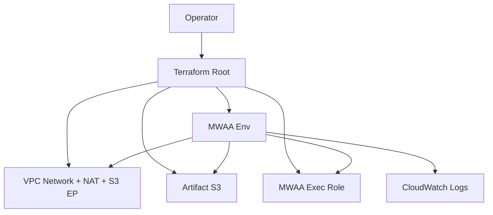

# U1 Foundation — Deployment Architecture

## Topology

```
                    Internet
                        |
                     +--+--+
                     | IGW |
                     +--+--+
                        |
              +---------+---------+
              | Public 10.10.0.0/24|
              |   NAT Gateway     |
              +---------+---------+
                        |
        +---------------+---------------+
        |                               |
+-------+--------+             +--------+-------+
| Private        |             | Private        |
| 10.10.1.0/24   |             | 10.10.2.0/24   |
| MWAA ENIs      |             | MWAA ENIs      |
+-------+--------+             +--------+-------+
        |                               |
        +---------------+---------------+
                        |
                 S3 Gateway Endpoint
                        |
                 ArtifactBucket (S3)
                        |
                 MWAA Environment
                 (PUBLIC web UI)
```

## Apply Sequence (logical)
1. `terraform init` (local state)
2. Plan/apply modules: network → artifact_store → identity → mwaa
3. Wait until MWAA `AVAILABLE`
4. (Later U4) `scripts/sync-dags.sh`

## Operator Path
| Step | Action |
|---|---|
| Auth | `aws sts get-caller-identity` |
| IAM review | Checklist vs `policies/terraform-apply-policy.json` |
| Apply | `scripts/apply.sh` or `terraform apply` |
| Verify | Console/API status AVAILABLE; open PUBLIC URL |
| Destroy | `terraform destroy` (runbook) |

## High-Level Mermaid



## Failure / Rollback
- Apply failure → fix config → re-apply (fail-fast)
- Full teardown → `terraform destroy`
- NAT SPOF accepted for PoC cost profile
