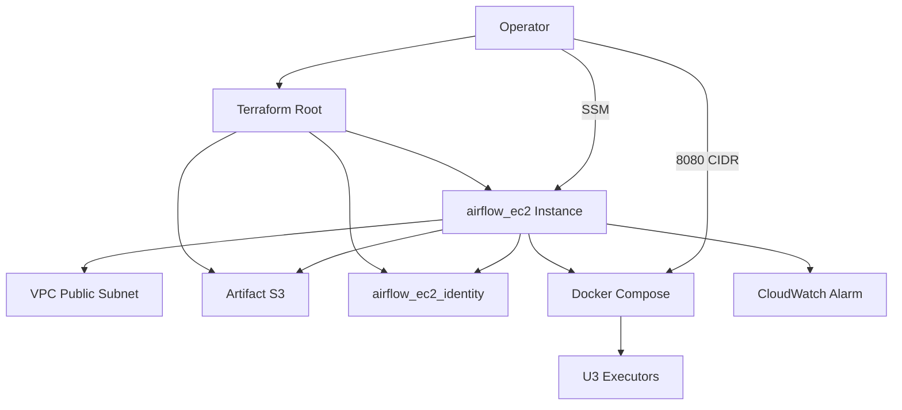

# U1-orchestrator-ec2 — Deployment Architecture

## Topology (default mode=ec2)

```
                         Internet
                             |
                          +--+--+
                          | IGW |
                          +--+--+
                             |
                   +---------+---------+
                   | Public 10.10.0.0/24|
                   |  EC2 Airflow Host   |
                   |  :8080 (CIDR only)  |
                   |  Docker Compose     |
                   +---------+---------+
                             |
              +--------------+--------------+
              |                             |
    S3 Gateway Endpoint              SSM (public API)
              |                             |
       ArtifactBucket                  Operator
    airflow-ec2/ + dags/            (Session Manager)
              |
    Lambda / Glue / ECS (U3) via instance role
```

Private subnets + NAT remain for U3 ECS; EC2 orchestrator uses public subnet.

## Apply Sequence (delta on existing stack)

1. `terraform init` (if new modules)
2. Set `orchestrator_mode = "ec2"` (default) and `operator_cidr`
3. Plan/apply order (logical):
   - `artifact_store` (existing)
   - `airflow_ec2_identity` (new, count=1)
   - `airflow_ec2` (upload S3 objects → create instance → alarm → SSM param)
   - Rewire lake/compute policies to EC2 role
   - **Skip** `module.mwaa` (count=0)
4. Wait EC2 running + bootstrap complete (~minutes)
5. `scripts/sync-dags.sh` (placeholder DAG for smoke)
6. Verify: SSM session, UI :8080, list DAGs, `airflow-ec2-status.sh`

## Mode Switch Reference

| Mode | Provisions | Skips |
|---|---|---|
| `ec2` | airflow_ec2 + airflow_ec2_identity | mwaa + mwaa identity |
| `mwaa` | network + artifact + identity + mwaa | airflow_ec2 modules |

Switching modes requires `terraform apply` (destroy one path, create other).

## Operator Path

| Step | Action |
|---|---|
| Auth | `aws sts get-caller-identity` |
| Apply | `bash scripts/apply.sh` (repo root) |
| UI password | `aws ssm get-parameter --name /{prefix}airflow/ui-password --with-decryption` |
| Shell | `aws ssm start-session --target {instance-id}` |
| UI | `http://{public_ip}:8080` (from outputs; IP may change after stop/start) |
| Sync DAGs | `bash scripts/sync-dags.sh` |
| Cost save | `bash scripts/airflow-ec2-stop.sh` |
| Resume | `bash scripts/airflow-ec2-start.sh` (update SG/CIDR if IP changed) |
| Destroy | `terraform destroy` (metadata lost) |

## Mermaid — EC2 Orchestrator Path



## Failure / Rollback

| Failure | Response |
|---|---|
| Bootstrap retries exhausted | SSM in → inspect journald; re-run bootstrap or replace instance |
| Apply partial | Fix TF → re-apply (fail-fast) |
| Wrong operator IP | Update `operator_cidr` → apply SG |
| Cost overrun | stop instance; destroy stack when done |
| RTO target | Recreate EC2 + re-sync DAGs (< 1h documented) |

## Integration with U2/U3

- Root `main.tf`: `aws_iam_role_policy` lake/compute use `orchestrator_role_arn` local
- U3 executors unchanged; invoke principal becomes EC2 role in default mode
- U4 (future): DAG uses outputs `orchestrator_role_arn`, `airflow_ui_url`, sync docs
