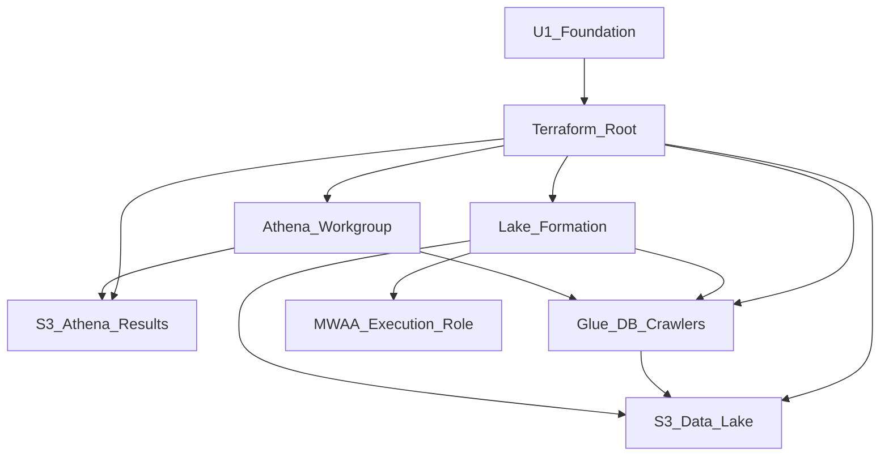

# U2 Data Lake and Governance — Deployment Architecture

## Topology (relative to U1)

```
U1 Foundation
  VPC + NAT + S3 Gateway Endpoint
  ArtifactBucket
  MWAA + ExecutionRole
           |
           | (same account / same TF root)
           v
U2 Lake and Governance (regional services)
  +------------------+     +----------------------+
  | Data S3 bucket   |     | Athena results S3    |
  | raw/ processed/  |     | lifecycle 7 days     |
  +--------+---------+     +----------+-----------+
           |                          |
           v                          |
  +--------+---------+                |
  | Glue DB + 2      |                |
  | Crawlers         |                |
  +--------+---------+                |
           |                          |
           v                          v
  +--------+---------+     +----------+-----------+
  | Lake Formation   |     | Athena Workgroup     |
  | tags + grants    |---->| enforce + output loc |
  +--------+---------+     +----------------------+
           |
           v
  Grants on MWAA ExecutionRole (additive)
```

Text alternative: U2 adds two S3 buckets, Glue catalog/crawlers, Lake Formation tags/grants, and an Athena workgroup in the same account as U1, without new VPC resources. MWAA keeps using the existing S3 gateway endpoint; U2 attaches lake permissions to the existing execution role.

## Apply Sequence (logical)
1. Confirm U1 applied (or apply full root including U1 resources).
2. Confirm Lake Formation **Data Lake administrator** set in account (manual).
3. Plan/apply U2 modules: `data_lake` → `glue_catalog` → `lake_formation` → `athena` (+ IAM attachments).
4. Operator: `scripts/seed-sample.sh` → start raw crawler → Athena query in workgroup.
5. U3/U4 consume outputs (bucket, DB, workgroup, role grants).

## Operator Path
| Step | Action |
|---|---|
| Prereq | LF admin + IAM review of apply policy |
| Apply | `scripts/apply.sh` / `terraform apply` (same root) |
| Seed | `scripts/seed-sample.sh` → `raw/dt=<date>/` |
| Discover | Start `{prefix}-raw-crawler` (console/CLI) |
| Query | Athena workgroup → results bucket |
| Verify | Tables in `{prefix}_lake`; TLS-only bucket policies present |

## High-Level Mermaid



## Failure / Rollback
- Apply failure on LF → verify admin prereq → re-apply
- Crawler with empty `raw/` → expected until seed
- Teardown → `terraform destroy` (order handled by TF graph); empty/delete bucket objects if destroy blocked
- No SNS rollback hooks in U2

## Outputs for Downstream

| Output | Consumers |
|---|---|
| `data_lake_bucket_name` / `arn` | U3, U4 |
| `athena_results_bucket_name` / `arn` | U4 |
| `glue_database_name` | U3, U4 |
| `raw_crawler_name` / `processed_crawler_name` | U4 |
| `athena_workgroup_name` | U4 |
| `glue_service_role_arn` | docs / U3 |
| LF tag keys/values | docs / U4 |
