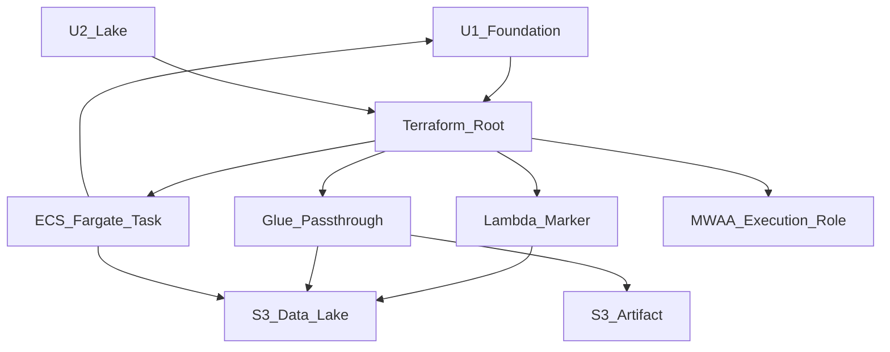

# U3 Compute Executors — Deployment Architecture

## Topology (relative to U1/U2)

```
U1 Foundation                    U2 Lake
  VPC / private subnets            data bucket (raw/, processed/)
  Artifact bucket                  Glue DB / LF / Athena
  MWAA + ExecutionRole
           \                         /
            \                       /
             v                     v
        U3 Compute Executors (same account / same TF root)
  +------------------+  +------------------+  +------------------+
  | Lambda marker    |  | Glue passthrough |  | ECS Fargate task |
  | (no VPC)         |  | script on artif. |  | private subnets  |
  +--------+---------+  +--------+---------+  +--------+---------+
           |                     |                     |
           +----------+----------+----------+----------+
                      |
                      v
           Additive IAM on MWAA ExecutionRole
           (Invoke / StartJobRun / RunTask / PassRole)
```

Text alternative: U3 adds Lambda, Glue Job, and an ECS Fargate task definition in the same Terraform root. Lambda runs outside the VPC; Glue is regional; ECS tasks run in U1 private subnets using the existing NAT. Data reads/writes go to the U2 lake bucket; the Glue script lives on the U1 artifact bucket. MWAA receives additive invoke permissions for U4.

## Apply Sequence (logical)
1. U1 + U2 applied (or full root including prior units).
2. Plan/apply U3 modules: `lambda_executor` → `glue_job` (upload script) → `ecs_executor` → MWAA policy.
3. Operator: `scripts/smoke-compute.sh` (optional) before U4 DAG.
4. U4 consumes outputs to wire Airflow operators.

## Operator Path
| Step | Action |
|---|---|
| Prereq | U1/U2 healthy; lake seed optional for Glue demo |
| Apply | `terraform apply` (same root) |
| Smoke | `bash scripts/smoke-compute.sh` |
| Verify | Marker objects in lake; Glue SUCCEEDED; ECS STOPPED exit 0 |
| Logs | CW log groups Lambda/ECS; Glue job run logs |

## High-Level Mermaid



## Failure / Rollback
- Apply failure → fix → re-apply (fail-fast)
- Smoke failure → check IAM/network/logs; re-run script (API backoff only)
- Teardown → `terraform destroy` (empty lake objects if needed)

## Outputs for Downstream (U4)

| Output | Consumers |
|---|---|
| `lambda_function_arn` / `name` | DAG LambdaInvoke |
| `glue_job_name` | DAG GlueJobOperator |
| `ecs_cluster_arn` | DAG EcsRunTaskOperator |
| `ecs_task_definition_arn` | DAG EcsRunTaskOperator |
| `ecs_subnet_ids` / `ecs_security_group_id` | RunTask network config |
| `lambda_role_arn` / `glue_role_arn` / `ecs_task_role_arn` / `ecs_execution_role_arn` | audit / PassRole |
