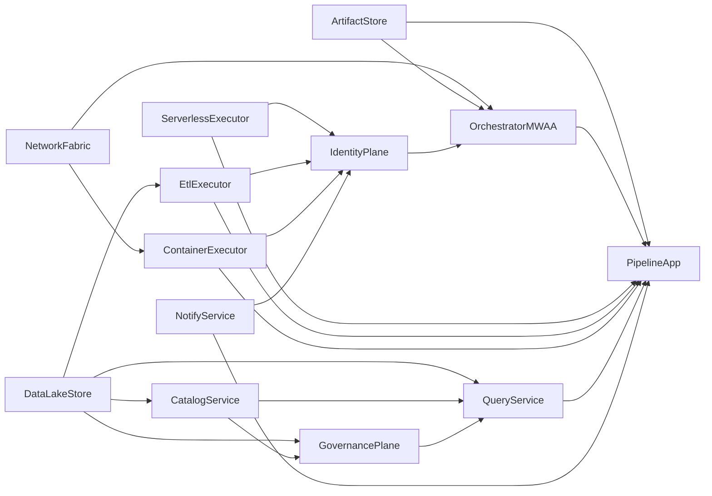

# Component Dependencies

## Dependency Matrix

| Component | Depends On | Depended By |
|---|---|---|
| NetworkFabric | — | OrchestratorMWAA, ContainerExecutor |
| ArtifactStore | — | OrchestratorMWAA, PipelineApp |
| DataLakeStore | — | CatalogService, EtlExecutor, GovernancePlane, QueryService, PipelineApp |
| IdentityPlane | ArtifactStore, DataLakeStore, executors (ARNs) | OrchestratorMWAA |
| ServerlessExecutor | Identity (local role) | PipelineApp, IdentityPlane (invoke grant) |
| EtlExecutor | DataLakeStore, CatalogService | PipelineApp, IdentityPlane |
| CatalogService | DataLakeStore | GovernancePlane, QueryService, PipelineApp |
| ContainerExecutor | NetworkFabric | PipelineApp, IdentityPlane |
| GovernancePlane | DataLakeStore, CatalogService | QueryService, PipelineApp |
| QueryService | DataLakeStore, GovernancePlane | PipelineApp |
| NotifyService | — | PipelineApp, IdentityPlane |
| OrchestratorMWAA | NetworkFabric, ArtifactStore, IdentityPlane | PipelineApp (runtime) |
| PipelineApp | OrchestratorMWAA + all compute/query/notify capabilities | — (end user journeys) |

## Communication Patterns

| From | To | Pattern | Mechanism |
|---|---|---|---|
| Terraform root | modules/* | Composition | module calls |
| OrchestratorMWAA | ArtifactStore | Read objects | MWAA S3 source bucket |
| PipelineApp | ServerlessExecutor | Sync invoke | Lambda operator / boto3 |
| PipelineApp | EtlExecutor | Async job | GlueJobOperator |
| PipelineApp | ContainerExecutor | Run task | EcsRunTaskOperator |
| PipelineApp | QueryService | Query | AthenaOperator |
| PipelineApp | NotifyService | Publish | SNS publish / callback |
| GovernancePlane | DataLakeStore | Control plane | Lake Formation APIs |
| IdentityPlane | * | Authorize | IAM policies on MWAA role |

## Mermaid — Dependency Flow



## ASCII — Layered View

```
+---------------------------+
|       PipelineApp         |
|   (DAG orchestration)     |
+-------------+-------------+
              |
              v
+-------------+-------------+
|     OrchestratorMWAA      |
+------+------+------+------+
       |      |      |
       v      v      v
   Serverless Etl  Container
   Executor  Exec  Executor
       |      |      |
       +------+------+--> QueryService --> NotifyService
                     |
                     v
              GovernancePlane
                     |
                     v
         CatalogService + DataLakeStore

Foundation: NetworkFabric | ArtifactStore | IdentityPlane
```

## Coupling Notes
- **Loose**: PipelineApp → capabilities via AWS APIs (names/ARNs as config).
- **Tight (acceptable)**: OrchestratorMWAA ↔ NetworkFabric/ArtifactStore/IdentityPlane (hard MWAA requirements).
- **Governance boundary**: Query/ETL should honor LF grants; IdentityPlane must not bypass with broad S3 `*`.
