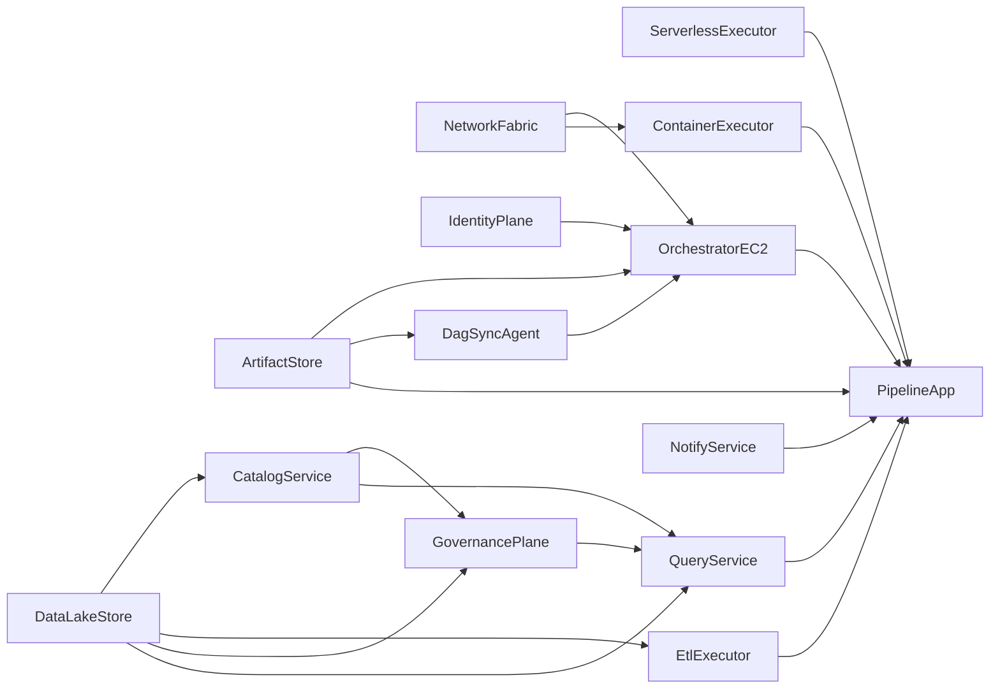

# Component Dependencies

> **Amendment**: OrchestratorEC2 é o runtime default; OrchestratorMWAA só no modo mwaa.

## Dependency Matrix

| Component | Depends On | Depended By |
|---|---|---|
| NetworkFabric | — | OrchestratorEC2, OrchestratorMWAA, ContainerExecutor |
| ArtifactStore | — | OrchestratorEC2, DagSyncAgent, OrchestratorMWAA, PipelineApp |
| DataLakeStore | — | CatalogService, EtlExecutor, GovernancePlane, QueryService, PipelineApp |
| IdentityPlane | ArtifactStore, DataLakeStore, executors (ARNs) | OrchestratorEC2 (default), OrchestratorMWAA (optional) |
| DagSyncAgent | ArtifactStore, OrchestratorEC2 | PipelineApp (indirect) |
| ServerlessExecutor | Identity (local role) | PipelineApp, IdentityPlane (invoke grant) |
| EtlExecutor | DataLakeStore, CatalogService | PipelineApp, IdentityPlane |
| CatalogService | DataLakeStore | GovernancePlane, QueryService, PipelineApp |
| ContainerExecutor | NetworkFabric | PipelineApp, IdentityPlane |
| GovernancePlane | DataLakeStore, CatalogService | QueryService, PipelineApp |
| QueryService | DataLakeStore, GovernancePlane | PipelineApp |
| NotifyService | — | PipelineApp, IdentityPlane |
| OrchestratorEC2 | NetworkFabric, ArtifactStore, IdentityPlane | PipelineApp (runtime default) |
| OrchestratorMWAA | NetworkFabric, ArtifactStore, IdentityPlane | PipelineApp (runtime se mode=mwaa) |
| PipelineApp | Active orchestrator + compute/query/notify | — |

## Communication Patterns

| From | To | Pattern | Mechanism |
|---|---|---|---|
| Terraform root | modules/* | Composition | module calls + `orchestrator_mode` |
| Apply | ArtifactStore | Upload compose package | S3 objects under `airflow-ec2/` |
| OrchestratorEC2 | ArtifactStore | Pull compose + periodic dags | user_data + DagSyncAgent |
| PipelineApp | ServerlessExecutor | Sync invoke | Lambda / boto3 (instance role) |
| PipelineApp | EtlExecutor | Async job | GlueJobOperator |
| PipelineApp | ContainerExecutor | Run task | EcsRunTaskOperator |
| PipelineApp | QueryService | Query | AthenaOperator |
| PipelineApp | NotifyService | Publish | SNS |
| Operator | OrchestratorEC2 | UI / shell | HTTPS-ish UI :8080 CIDR; SSM Session Manager |
| IdentityPlane | * | Authorize | IAM on EC2 role (default) |

## Mermaid — Dependency Flow (mode=ec2)



## ASCII — Layered View (default)

```
+---------------------------+
|       PipelineApp         |
|   (DAG orchestration)     |
+-------------+-------------+
              |
              v
+-------------+-------------+
|     OrchestratorEC2       |
|  Compose + DagSyncAgent   |
+------+------+------+------+
       |      |      |
       v      v      v
   Serverless Etl  Container
   Executor  Exec  Executor
       |      |      |
       +------+------+--> QueryService --> NotifyService
                     |
                     v
              GovernancePlane
                     |
                     v
         CatalogService + DataLakeStore

Foundation: NetworkFabric | ArtifactStore | IdentityPlane (EC2 role)
```

## Coupling Notes
- **Loose**: PipelineApp → capabilities via AWS APIs (ARNs/config).
- **Tight (acceptable)**: OrchestratorEC2 ↔ NetworkFabric / ArtifactStore / IdentityPlane.
- **Mode switch**: `orchestrator_mode` troca o runtime; policies anexam ao principal ativo.
- **No EIP**: public IP muda em stop/start — documentar no README.
