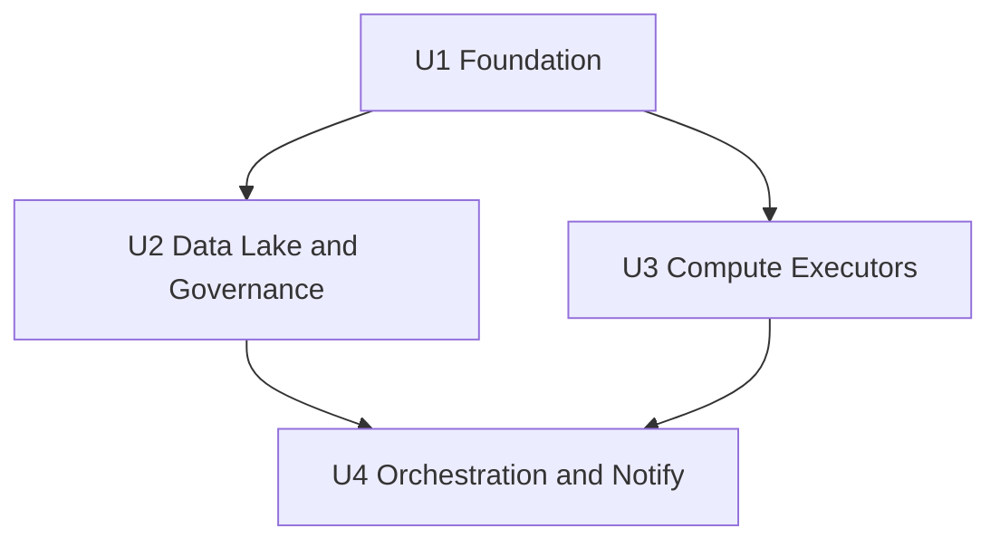

# Unit of Work Dependencies

## Dependency Graph



## ASCII

```
        U1 Foundation
           /      \
          v        v
         U2        U3
     Lake/Gov    Compute
          \      /
           v    v
      U4 Orchestration+Notify
```

## Dependency Matrix

| Unit | Depends on | Blocks | Nature |
|---|---|---|---|
| U1 | — | U2, U3, U4 | Hard (network, MWAA, artifact bucket, base IAM) |
| U2 | U1 | U4 | Soft/Hard (lake outputs, LF, Athena para DAG) |
| U3 | U1 | U4 | Hard (executors + MWAA invoke grants; ECS precisa subnets/SG) |
| U4 | U1, U2, U3 | — | Hard (DAG referencia todos os nomes/ARNs) |

## Shared Resources
| Resource | Owned by | Consumed by |
|---|---|---|
| VPC / private subnets / SG | U1 | U3 (ECS), U1 MWAA |
| Artifact S3 bucket | U1 | U4 (sync), U1 MWAA |
| Data lake bucket | U2 | U3 (Glue), U4 (Athena tasks), U2 LF |
| MWAA execution role | U1 | U3 (policy attachments), U4 (runtime) |
| Provider/tags/vars | root | all units |

## Construction Order Recommendation
1. Implement/design U1 first  
2. U2 and U3 in parallel (Construction loops)  
3. U4 last (DAG + SNS + docs)  
4. Single `terraform apply` at root after modules wired  

## Integration Checkpoints
| After | Validate |
|---|---|
| U1 | `terraform apply` parcial ou plan com MWAA; UI reachable |
| U2 | Crawler/LF/Athena resources exist |
| U3 | Manual invoke Lambda/Glue/ECS com role MWAA (ou policy simulator) |
| U4 | Sync DAG + full DAG run + SNS message |
