# Execution Plan — EC2 Airflow Orchestrator Change

## Detailed Analysis Summary

### Transformation Scope (Brownfield)
- **Transformation Type**: Infrastructure / single-component swap (orchestrator)
- **Primary Changes**: Replace default managed MWAA with EC2 `t3.medium` + Docker Compose Airflow 2.11.2
- **Related Components**: `modules/mwaa` (gated), `modules/identity` (new EC2 role), network SG, artifact sync, U3 lake/compute policies attachment, README/scripts, U4 DAG docs later

### Change Impact Assessment
- **User-facing changes**: Yes — UI via EC2 `:8080` + operator CIDR (not MWAA webserver)
- **Structural changes**: Yes — orchestrator host model (managed service → VM + Compose)
- **Data model changes**: No
- **API changes**: No (executors U2/U3 unchanged)
- **NFR impact**: Yes — cost model, SG lockdown, instance role, no HA

### Component Relationships
- **Primary**: Orchestrator (U1) — EC2 + Compose + bootstrap
- **Infrastructure**: network (public subnet, SG), identity (airflow-ec2-execution), artifact_store (DAG sync source)
- **Dependent**: U3 policies must trust EC2 role; U4 sync/smoke docs
- **Supporting**: start/stop scripts, README

### Risk Assessment
- **Risk Level**: Medium (IAM wiring + bootstrap Docker; MWAA path kept via flag)
- **Rollback Complexity**: Easy (`orchestrator_mode=mwaa` when subscribed; or destroy EC2)
- **Testing Complexity**: Moderate (UI, sync DAGs, invoke Lambda/Glue/ECS)

## Workflow Visualization

### Mermaid Diagram

```mermaid
flowchart TD
    Start(["User Request"])

    subgraph INCEPTION["INCEPTION PHASE"]
        WD["Workspace Detection<br/>COMPLETED"]
        RE["Reverse Engineering<br/>SKIP"]
        RA["Requirements Analysis<br/>COMPLETED"]
        US["User Stories<br/>SKIP"]
        WP["Workflow Planning<br/>EXECUTE"]
        AD["Application Design<br/>EXECUTE"]
        UG["Units Generation<br/>SKIP"]
    end

    subgraph CONSTRUCTION["CONSTRUCTION PHASE"]
        FD["Functional Design<br/>EXECUTE"]
        NFRA["NFR Requirements<br/>EXECUTE"]
        NFRD["NFR Design<br/>EXECUTE"]
        ID["Infrastructure Design<br/>EXECUTE"]
        CG["Code Generation<br/>EXECUTE"]
        BT["Build and Test<br/>EXECUTE"]
    end

    subgraph OPERATIONS["OPERATIONS PHASE"]
        OPS["Operations<br/>PLACEHOLDER"]
    end

    Start --> WD
    WD --> RE
    RE --> RA
    RA --> US
    US --> WP
    WP --> AD
    AD --> UG
    UG --> FD
    FD --> NFRA
    NFRA --> NFRD
    NFRD --> ID
    ID --> CG
    CG --> BT
    BT --> OPS
    OPS --> EndNode(["Complete"])

    style WD fill:#4CAF50,stroke:#1B5E20,stroke-width:3px,color:#fff
    style RA fill:#4CAF50,stroke:#1B5E20,stroke-width:3px,color:#fff
    style WP fill:#FFA726,stroke:#E65100,stroke-width:3px,stroke-dasharray: 5 5,color:#000
    style AD fill:#FFA726,stroke:#E65100,stroke-width:3px,stroke-dasharray: 5 5,color:#000
    style FD fill:#FFA726,stroke:#E65100,stroke-width:3px,stroke-dasharray: 5 5,color:#000
    style NFRA fill:#FFA726,stroke:#E65100,stroke-width:3px,stroke-dasharray: 5 5,color:#000
    style NFRD fill:#FFA726,stroke:#E65100,stroke-width:3px,stroke-dasharray: 5 5,color:#000
    style ID fill:#FFA726,stroke:#E65100,stroke-width:3px,stroke-dasharray: 5 5,color:#000
    style CG fill:#4CAF50,stroke:#1B5E20,stroke-width:3px,color:#fff
    style BT fill:#4CAF50,stroke:#1B5E20,stroke-width:3px,color:#fff
    style RE fill:#BDBDBD,stroke:#424242,stroke-width:2px,stroke-dasharray: 5 5,color:#000
    style US fill:#BDBDBD,stroke:#424242,stroke-width:2px,stroke-dasharray: 5 5,color:#000
    style UG fill:#BDBDBD,stroke:#424242,stroke-width:2px,stroke-dasharray: 5 5,color:#000
    style OPS fill:#BDBDBD,stroke:#424242,stroke-width:2px,stroke-dasharray: 5 5,color:#000
    style Start fill:#CE93D8,stroke:#6A1B9A,stroke-width:3px,color:#000
    style EndNode fill:#CE93D8,stroke:#6A1B9A,stroke-width:3px,color:#000
```



### Text Alternative

```text
INCEPTION: WD COMPLETED -> RE SKIP -> RA COMPLETED -> US SKIP -> WP EXECUTE -> AD EXECUTE -> UG SKIP
CONSTRUCTION (unit U1-orchestrator-ec2): FD -> NFRA -> NFRD -> ID -> CG -> then BT platform
OPERATIONS: PLACEHOLDER
```

## Phases to Execute

### INCEPTION PHASE
- [x] Workspace Detection — COMPLETED
- [x] Reverse Engineering — SKIPPED (docs current)
- [x] Requirements Analysis — COMPLETED
- [x] User Stories — SKIPPED (infra swap; FRs locked)
- [x] Workflow Planning — IN PROGRESS
- [ ] Application Design — **EXECUTE** (minimal)
  - **Rationale**: Troca OrchestratorMWAA → OrchestratorEC2; contratos IAM/sync/UI
- [ ] Units Generation — **SKIP**
  - **Rationale**: Sem nova unidade; delta em U1 (+ wiring IAM U3); atualizar `unit-of-work.md` no Application Design

### CONSTRUCTION PHASE (unit lógico: U1-orchestrator-ec2)
- [ ] Functional Design — **EXECUTE**
  - **Rationale**: Bootstrap Compose, sync DAGs, modo `orchestrator_mode`
- [ ] NFR Requirements — **EXECUTE**
  - **Rationale**: Custo, SG CIDR, instance role, single-AZ lab
- [ ] NFR Design — **EXECUTE**
  - **Rationale**: Padrões de IAM/SG/lifecycle stop-start
- [ ] Infrastructure Design — **EXECUTE**
  - **Rationale**: EC2, EIP, SG, user_data, module layout, conditional MWAA
- [ ] Code Generation — **EXECUTE** (ALWAYS)
- [ ] Build and Test — **EXECUTE** (ALWAYS; após código do delta; E2E completo com U4)

### OPERATIONS PHASE
- [ ] Operations — PLACEHOLDER

## Package Change Sequence

1. **U1 Foundation delta** — module `airflow_ec2` (or equivalent), identity EC2 role, root `orchestrator_mode`, SG, scripts start/stop, README
2. **U3 IAM wiring** — attach lake/compute policies to `airflow-ec2-execution` when mode=ec2
3. **U4** (later, existing plan) — DAG E2E + SNS using EC2 orchestrator
4. **Build and Test** — apply, UI, sync, smoke-compute, optional DAG run

## Estimated Timeline
- **Total stages this change**: Application Design + 4 design stages + Code Gen + (Build later with U4)
- **Estimated duration**: 1 sessão Construction para o delta EC2; U4 em seguida

## Success Criteria
- **Primary Goal**: Airflow 2.11.2 na EC2 orquestra U2/U3 sem MWAA
- **Key Deliverables**: Terraform EC2+Compose, role EC2, sync DAGs, scripts start/stop, `orchestrator_mode`
- **Quality Gates**: `terraform validate`; UI 8080 só do CIDR; instance role invoca executors; stop/start documentados
- **Integration Testing**: sync-dags + smoke-compute (+ DAG U4 quando pronto)
