# Execution Plan

## Detailed Analysis Summary

### Transformation Scope
- **Project Type**: Greenfield
- **Transformation Type**: N/A (greenfield)
- **Primary Changes**: Provisionar plataforma de dados AWS orquestrada por MWAA (Terraform)
- **Related Components**: Rede, S3 (DAGs + lake), MWAA, Lambda, Glue, ECS Fargate, Lake Formation, Athena, SNS, IAM

### Change Impact Assessment
- **User-facing changes**: Yes — UI MWAA pública, sync de DAGs, consultas Athena, notificações SNS
- **Structural changes**: Yes — nova arquitetura de plataforma (orquestração + lake + governança + compute)
- **Data model changes**: Yes — Glue Catalog / tabelas / LF-Tags (não RDBMS tradicional)
- **API changes**: No — sem API HTTP própria; contratos via AWS APIs e DAG
- **NFR impact**: Yes — least privilege IAM, custo (NAT/MWAA), observabilidade básica (CloudWatch/SNS)

### Risk Assessment
- **Risk Level**: Medium
- **Rollback Complexity**: Moderate (destroy Terraform; cuidado com S3 versionado e LF settings)
- **Testing Complexity**: Moderate (validate + plan + smoke E2E do DAG)
- **Main risks**: Quota/disponibilidade MWAA; versão Airflow na conta; Lake Formation admin pré-requisito; custo NAT+MWAA em `dev`

## Workflow Visualization

```mermaid
flowchart TD
    Start(["User Request"])

    subgraph INCEPTION["INCEPTION PHASE"]
        WD["Workspace Detection<br/>COMPLETED"]
        RE["Reverse Engineering<br/>SKIP"]
        RA["Requirements Analysis<br/>COMPLETED"]
        US["User Stories<br/>COMPLETED"]
        WP["Workflow Planning<br/>IN PROGRESS"]
        AD["Application Design<br/>EXECUTE"]
        UG["Units Generation<br/>EXECUTE"]
    end

    subgraph CONSTRUCTION["CONSTRUCTION PHASE"]
        FD["Functional Design<br/>EXECUTE"]
        NFRA["NFR Requirements<br/>EXECUTE"]
        NFRD["NFR Design<br/>EXECUTE"]
        ID["Infrastructure Design<br/>EXECUTE"]
        CG["Code Generation<br/>EXECUTE"]
        BT["Build and Test<br/>EXECUTE"]
    end

    subgraph OPERATIONS["OPERATIONS PHASE"]
        OPS["Operations<br/>PLACEHOLDER"]
    end

    Start --> WD
    WD --> RE
    RE --> RA
    WD --> RA
    RA --> US
    US --> WP
    WP --> AD
    AD --> UG
    UG --> FD
    FD --> NFRA
    NFRA --> NFRD
    NFRD --> ID
    ID --> CG
    CG --> BT
    BT --> OPS
    BT --> EndNode(["Complete"])

    style WD fill:#4CAF50,stroke:#1B5E20,stroke-width:3px,color:#fff
    style RA fill:#4CAF50,stroke:#1B5E20,stroke-width:3px,color:#fff
    style US fill:#4CAF50,stroke:#1B5E20,stroke-width:3px,color:#fff
    style WP fill:#4CAF50,stroke:#1B5E20,stroke-width:3px,color:#fff
    style RE fill:#BDBDBD,stroke:#424242,stroke-width:2px,stroke-dasharray: 5 5,color:#000
    style AD fill:#FFA726,stroke:#E65100,stroke-width:3px,stroke-dasharray: 5 5,color:#000
    style UG fill:#FFA726,stroke:#E65100,stroke-width:3px,stroke-dasharray: 5 5,color:#000
    style FD fill:#FFA726,stroke:#E65100,stroke-width:3px,stroke-dasharray: 5 5,color:#000
    style NFRA fill:#FFA726,stroke:#E65100,stroke-width:3px,stroke-dasharray: 5 5,color:#000
    style NFRD fill:#FFA726,stroke:#E65100,stroke-width:3px,stroke-dasharray: 5 5,color:#000
    style ID fill:#FFA726,stroke:#E65100,stroke-width:3px,stroke-dasharray: 5 5,color:#000
    style CG fill:#4CAF50,stroke:#1B5E20,stroke-width:3px,color:#fff
    style BT fill:#4CAF50,stroke:#1B5E20,stroke-width:3px,color:#fff
    style OPS fill:#BDBDBD,stroke:#424242,stroke-width:2px,stroke-dasharray: 5 5,color:#000
    style Start fill:#CE93D8,stroke:#6A1B9A,stroke-width:3px,color:#000
    style EndNode fill:#CE93D8,stroke:#6A1B9A,stroke-width:3px,color:#000
    style INCEPTION fill:#BBDEFB,stroke:#1565C0,stroke-width:3px,color:#000
    style CONSTRUCTION fill:#C8E6C9,stroke:#2E7D32,stroke-width:3px,color:#000
    style OPERATIONS fill:#FFF59D,stroke:#F57F17,stroke-width:3px,color:#000

    linkStyle default stroke:#333,stroke-width:2px
```



### Text Alternative
```
INCEPTION:
  Workspace Detection     COMPLETED
  Reverse Engineering     SKIP (greenfield)
  Requirements Analysis   COMPLETED
  User Stories            COMPLETED
  Workflow Planning       IN PROGRESS
  Application Design      EXECUTE
  Units Generation        EXECUTE

CONSTRUCTION:
  Functional Design       EXECUTE
  NFR Requirements        EXECUTE
  NFR Design              EXECUTE
  Infrastructure Design   EXECUTE
  Code Generation         EXECUTE (always)
  Build and Test          EXECUTE (always)

OPERATIONS:
  Operations              PLACEHOLDER
```

## Phases to Execute

### INCEPTION PHASE
- [x] Workspace Detection (COMPLETED)
- [x] Reverse Engineering (SKIPPED — greenfield)
- [x] Requirements Analysis (COMPLETED)
- [x] User Stories (COMPLETED)
- [x] Workflow Planning (IN PROGRESS)
- [ ] Application Design — **EXECUTE**
  - **Rationale**: Novos componentes/serviços AWS e responsabilidades (MWAA, lake, executors, LF, Athena, SNS) precisam de design explícito antes do código
- [ ] Units Generation — **EXECUTE**
  - **Rationale**: Escopo B é multi-domínio IaC; decompor em unidades (fundação, lake/governança, compute, orquestração/DAG) reduz risco e paraleliza Construction

### CONSTRUCTION PHASE
- [ ] Functional Design — **EXECUTE**
  - **Rationale**: Fluxo do DAG E2E (Lambda → Glue → ECS → Athena → SNS) e regras de governança precisam de desenho funcional por unidade
- [ ] NFR Requirements — **EXECUTE**
  - **Rationale**: Least privilege, custo `dev`, logging e acesso PUBLIC consciente são NFRs centrais
- [ ] NFR Design — **EXECUTE**
  - **Rationale**: Incorporar padrões IAM/logging/tagging nas unidades
- [ ] Infrastructure Design — **EXECUTE**
  - **Rationale**: Projeto é infraestrutura; mapear componentes lógicos → recursos AWS Terraform é o núcleo
- [ ] Code Generation — **EXECUTE** (ALWAYS)
  - **Rationale**: Gerar Terraform (`versions.tf`, `variables.tf`, `network.tf`, `iam.tf`, `s3.tf`, `mwaa.tf`, executors, LF, Athena, SNS) + DAG exemplo + política apply
- [ ] Build and Test — **EXECUTE** (ALWAYS)
  - **Rationale**: `terraform fmt/validate/plan` + instruções de sync DAG e smoke E2E

### OPERATIONS PHASE
- [ ] Operations — PLACEHOLDER

## Proposed Units (preview — confirmado em Units Generation)

| Unit | Escopo |
|---|---|
| U1 Foundation | VPC/NAT/SG, S3 artefatos MWAA, IAM base MWAA, ambiente MWAA |
| U2 Data Lake and Governance | S3 lake, Glue DB/Crawler, Lake Formation + LF-Tags, Athena workgroup |
| U3 Compute Executors | Lambda, Glue Job, ECS Fargate + roles/perms MWAA |
| U4 Orchestration and Notify | DAG exemplo, requirements, SNS, docs de sync/apply policy |

## Estimated Timeline
- **Total Stages remaining (execute)**: 8 (AD, UG, FD, NFRA, NFRD, ID, CG, BT)
- **Estimated Duration**: 1 sessão longa de Construction após fechar Inception design/units

## Success Criteria
- **Primary Goal**: `terraform apply` sobe a plataforma; DAG E2E exercita Lambda/Glue/ECS; LF+Athena+SNS demonstráveis
- **Key Deliverables**: Terraform comentado por arquivo; política apply; `dags/` + README; artefatos AI-DLC
- **Quality Gates**: Sem `Action="*"` / AdministratorAccess; validate/plan OK; checklist US-01..US-10 atendível
