# Execution Plan — U4 Orchestration and Notify

## Detailed Analysis Summary

### Transformation Scope (Brownfield)
- **Transformation Type**: Infrastructure + application (pipeline) completion
- **Primary Changes**: SNS module Terraform; IAM EC2 extensions; replace placeholder DAG with E2E `lab_pipeline_e2e.py`; `requirements.txt` Amazon provider; README/lab-guide E2E flow
- **Related Components**: `NotifyService` (`modules/sns`), `PipelineApp` (`dags/`), `airflow_ec2_identity` / orchestrator IAM, U2 Athena/Glue Catalog (consume), U3 Lambda/Glue/ECS (invoke), artifact sync scripts

### Change Impact Assessment
- **User-facing changes**: Yes — new DAG in Airflow UI; optional SNS email; lab-guide E2E steps
- **Structural changes**: Minor — new SNS module + IAM policy attachments; no VPC/orchestrator host change
- **Data model changes**: No
- **API changes**: No (consume existing U2/U3 interfaces)
- **NFR impact**: Yes — SNS publish least privilege, Athena query scope, provider pin, cost (no aggressive schedule)

### Component Relationships
- **Primary**: PipelineApp (DAG) + NotifyService (SNS)
- **Infrastructure**: `modules/sns`, orchestrator EC2 role policies, root `main.tf` wiring
- **Shared / upstream**: U2 Athena workgroup + Glue DB; U3 function/job/cluster names/ARNs
- **Dependent**: Operator docs (README, lab-guide); sync-dags scripts
- **Supporting**: Airflow Variables for schedule/resource names; optional email subscription

### Risk Assessment
- **Risk Level**: Medium (IAM + operator configs + parallel task failure modes)
- **Rollback Complexity**: Easy (destroy SNS module; restore placeholder DAG via git; revoke policies)
- **Testing Complexity**: Moderate (full E2E needs seed optional path + live AWS invoke)

## Workflow Visualization

### Mermaid Diagram

```mermaid
flowchart TD
    Start(["User Request U4"])

    subgraph INCEPTION["INCEPTION PHASE"]
        WD["Workspace Detection<br/>COMPLETED"]
        RE["Reverse Engineering<br/>SKIP"]
        RA["Requirements Analysis<br/>COMPLETED"]
        US["User Stories<br/>SKIP"]
        WP["Workflow Planning<br/>EXECUTE"]
        AD["Application Design<br/>SKIP"]
        UG["Units Generation<br/>SKIP"]
    end

    subgraph CONSTRUCTION["CONSTRUCTION PHASE"]
        FD["Functional Design<br/>EXECUTE"]
        NFRA["NFR Requirements<br/>EXECUTE"]
        NFRD["NFR Design<br/>EXECUTE"]
        ID["Infrastructure Design<br/>EXECUTE"]
        CG["Code Generation<br/>EXECUTE"]
        BT["Build and Test<br/>EXECUTE"]
    end

    subgraph OPERATIONS["OPERATIONS PHASE"]
        OPS["Operations<br/>PLACEHOLDER"]
    end

    Start --> WD
    WD --> RE
    RE --> RA
    RA --> US
    US --> WP
    WP --> AD
    AD --> UG
    UG --> FD
    FD --> NFRA
    NFRA --> NFRD
    NFRD --> ID
    ID --> CG
    CG --> BT
    BT --> OPS
    OPS --> EndNode(["Complete"])

    style WD fill:#4CAF50,stroke:#1B5E20,stroke-width:3px,color:#fff
    style RA fill:#4CAF50,stroke:#1B5E20,stroke-width:3px,color:#fff
    style WP fill:#FFA726,stroke:#E65100,stroke-width:3px,stroke-dasharray: 5 5,color:#000
    style FD fill:#FFA726,stroke:#E65100,stroke-width:3px,stroke-dasharray: 5 5,color:#000
    style NFRA fill:#FFA726,stroke:#E65100,stroke-width:3px,stroke-dasharray: 5 5,color:#000
    style NFRD fill:#FFA726,stroke:#E65100,stroke-width:3px,stroke-dasharray: 5 5,color:#000
    style ID fill:#FFA726,stroke:#E65100,stroke-width:3px,stroke-dasharray: 5 5,color:#000
    style CG fill:#4CAF50,stroke:#1B5E20,stroke-width:3px,color:#fff
    style BT fill:#4CAF50,stroke:#1B5E20,stroke-width:3px,color:#fff
    style RE fill:#BDBDBD,stroke:#424242,stroke-width:2px,stroke-dasharray: 5 5,color:#000
    style US fill:#BDBDBD,stroke:#424242,stroke-width:2px,stroke-dasharray: 5 5,color:#000
    style AD fill:#BDBDBD,stroke:#424242,stroke-width:2px,stroke-dasharray: 5 5,color:#000
    style UG fill:#BDBDBD,stroke:#424242,stroke-width:2px,stroke-dasharray: 5 5,color:#000
    style OPS fill:#BDBDBD,stroke:#424242,stroke-width:2px,stroke-dasharray: 5 5,color:#000
    style Start fill:#CE93D8,stroke:#6A1B9A,stroke-width:3px,color:#000
    style EndNode fill:#CE93D8,stroke:#6A1B9A,stroke-width:3px,color:#000
```



### Text Alternative

```text
INCEPTION: WD COMPLETED -> RE SKIP -> RA COMPLETED -> US SKIP -> WP EXECUTE -> AD SKIP -> UG SKIP
CONSTRUCTION (unit U4-orchestration-notify): FD -> NFRA -> NFRD -> ID -> CG -> BT
OPERATIONS: PLACEHOLDER
```

## Phases to Execute

### INCEPTION PHASE
- [x] Workspace Detection (COMPLETED)
- [x] Reverse Engineering (SKIPPED — artifacts current)
- [x] Requirements Analysis (COMPLETED — `u4-orchestration-notify-requirements.md`)
- [x] User Stories (SKIPPED — US-05, US-06, US-07, US-09 already cover U4)
- [x] Workflow Planning (IN PROGRESS — this document)
- [ ] Application Design — **SKIP**
  - **Rationale**: `NotifyService` e `PipelineApp` já definidos em `application-design/`; métodos Athena/SNS/Lambda/Glue/ECS já listados. Detalhe do grafo paralelo e branch SELECT ficam no Functional Design.
- [ ] Units Generation — **SKIP**
  - **Rationale**: Unidade U4 já definida na geração de unidades global; escopo único.

### CONSTRUCTION PHASE (unit: `u4-orchestration-notify`)
- [ ] Functional Design — **EXECUTE**
  - **Rationale**: Grafo Lambda → Glue ∥ ECS → Athena (SHOW + SELECT opcional) → SNS; regras de Variable schedule; payload/callback
- [ ] NFR Requirements — **EXECUTE**
  - **Rationale**: Least privilege SNS/Athena; pin provider; custo (sem schedule agressivo)
- [ ] NFR Design — **EXECUTE**
  - **Rationale**: Padrões IAM e observabilidade SNS a incorporar
- [ ] Infrastructure Design — **EXECUTE**
  - **Rationale**: Mapear `modules/sns`, variables, outputs, attachments IAM no root
- [ ] Code Generation — **EXECUTE** (ALWAYS)
  - **Rationale**: Terraform SNS + IAM; DAG; requirements.txt; docs
- [ ] Build and Test — **EXECUTE** (ALWAYS)
  - **Rationale**: validate/plan + instruções E2E atualizadas

### OPERATIONS PHASE
- [ ] Operations — PLACEHOLDER
  - **Rationale**: Runbooks manuais já em `docs/lab-guide.md`; expansão futura

## Module Update Strategy
- **Update Approach**: Sequential (single unit U4)
- **Critical Path**: SNS module + IAM → DAG + requirements → docs → Build/Test
- **Coordination Points**: Outputs U2/U3 (names/ARNs) consumidos pelo DAG/Variables; sync-dags inalterado no protocolo
- **Testing Checkpoints**: `terraform validate/plan`; sync + trigger UI; SNS message; optional seed SELECT

## Package Change Sequence
1. `terraform/modules/sns` (new)
2. Root wiring + EC2 orchestrator IAM policy extensions
3. `dags/lab_pipeline_e2e.py` (add) + remove `placeholder_smoke.py`
4. `requirements.txt`
5. README + `docs/lab-guide.md`
6. `aidlc-docs/construction/build-and-test/` updates for E2E

## Estimated Timeline
- **Stages remaining (execute)**: 6 (FD, NFRA, NFRD, ID, CG, BT)
- **Estimated Duration**: 1 sessão de Construction após aprovar este plano

## Success Criteria
- **Primary Goal**: DAG E2E no Airflow EC2 notifica SNS após Lambda + Glue ∥ ECS + Athena
- **Key Deliverables**: `modules/sns`, IAM updates, `lab_pipeline_e2e.py`, `requirements.txt`, docs E2E
- **Quality Gates**: Sem `Action="*"`, validate/plan OK, FR-U4-01..07 / US-05..07,US-09 atendíveis
- **Integration Testing**: Trigger manual E2E + verificação SNS (e Athena results)
- **Operational Readiness**: lab-guide com start → sync → trigger → stop

## Extension Compliance (U4)
| Extension | Enabled | Applicable | Status |
|---|---|---|---|
| Security Baseline | No | N/A | Ignored per Extension Configuration |

## User Override Notes
Você pode pedir inclusão de Application Design leve (atualizar `components.md`/`component-methods.md` com grafo paralelo) ou Histórias U4 dedicadas antes da Construction.
